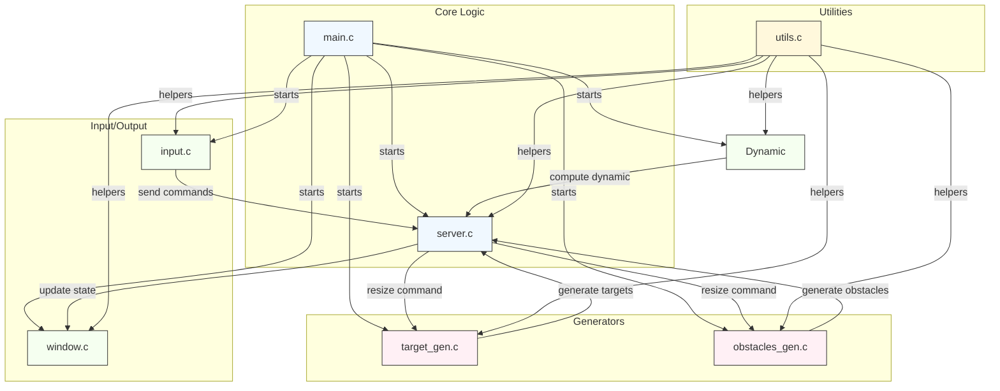

# ARP(Advanced Robotic Programming) Project 

### Description
This repository contains a set of C programs to implement a simple robot 2D game using the library `ncurses`. The robot, represented by a 'x', is moving around a resizable window and can be controlled with some keyboard keyboard. The aim of the game is to obtain the target 'T' without crashing into the obstacles 'O'. A score is computed based on the number of targets captured. 


<!-- ### Project structure (summary)
- `main.c` — possible entry point (check contents to run the correct binary).
- `input.c` — input handling.
- `server.c` — server-side code.
- `utils.c`, `window.c`, `dynamic.c`, `resize.c`, `obstacles_gen.c`, `target_gen.c`, `tar_gen/`, `obs_gen/` — utilities and generators.
- `include/` — local headers (e.g. `protocol.h`, `utils.h`).
- `config/parameters.txt` — configuration parameters.
- `log/` — logs produced by runs. -->

#### Input Commands
The following keyboard commands control the robot during gameplay.
| Input             | Action               | 
| ----------------- | -------------------- | 
| **w**             | moving up            | 
| **a**             | moving left         | 
| **d**             | moving right       | 
| **x**             | moving down        |
| **s**             | break              | 
| **q**             | moving left up          | 
| **e**             | moving right up          | 
| **z**             | moving left down          | 
| **c**             | moving right down          | 
| **X**             | quit game       |


### Requirements
- `gcc` compiler
- `ncurses` library installed 
- Useful tools: `make`, `bash`.

### Build
Run the following command from the project root to compile all `.c` files. The script.sh file is a simple script file to compile all the programs and link the lib in the `include/` folder. 
Two possible ways:
- using `MakeFile`:
```bash
  make clean
  make 
```
- using `bash` script file:
```bash
sh script.sh
```

Notes:
- All the executables will be created in the project root folder.

### Run
- After building, run the starting `game` executable from the project root folder. 
```bash
./game
```
Notes:
- Make sure to run the exec form the main project folder!!!

### Configuration files
- `config/parameters.txt` contains adjustable parameters. Review and edit it before running the program. It is possibile to change some parameters such ad the `ETA` value to compute the repulsion force of the obstacles.

### Logs
- Logs are written to the `log/` folder (e.g. `main_log.text`, `input_log.text`, etc.). Each process has its own log file. 

## Project Architecture

This diagram provides a high-level architecture of the project and a short explanation of components and relationships. The diagram is in Mermaid syntax and can be rendered by editors that support Mermaid (VS Code Mermaid Preview, GitHub, GitLab, etc.).



Structure:
This is a conceptual diagram based on the project repository. It shows the typical roles each entity likely plays:
  - `main.c` is the entry point and likely starts all the processes.
  - `server.c` contains the core logic and coordinates data between target and obstacles generators, input, window and dynamic
  - `input.c` captures user/input events and forwards them to the server logic. Also provides a simple GUI to diplay the variables of the drone.
  - `target_gen.c` and `obstacles_gen.c` generate data fed into the server (targets/obstacles).
  - `window.c` handles rendering/displaying state produced by the server using the lib ncurses.
  - `utils.c` provides shared helper functions used across components to load configuration and logging,
  - `config/parameters.txt` provides runtime parameters.
  - `log/` stores runtime logs.

How to render
- Mermaid: view `docs/architecture.md` with a Mermaid-capable viewer.

## Protocol
The server process acts as a blackboard and communicate with all the other processes using some messages defined in the file `protocol.h`. Below you can find a list of all the defined messages and data-structures:

- ***Drone***: this struct contains the variables of the drone such as velocity, position and force.
- ***Target***: defined the target object position and its id. Also specify if the target is active or not.
- ***Obstacle***: defined the obstacle object position and specify the obstacle is active or not. 
- ***WorldState***: contains the full state of the world shared by the server and sent to all the other processes, including the drone, all targets, all obstacles, the number of active targets, number of obstacles and map dimensions.
- ***CommandType***: enumeration of all the types of commands sent by the input process to the server.
- ***InputCommand***: message sent by input to apply a force to the drone or issue a control command. It contains a command type and optional force components.
- ***MessageType***: defines the types of atomic messages exchanged to the server process:
  * MSG_DRONE_UPDATE: message sent from `dynamic.c` to update the drone state.
  * MSG_TARGET: message sent from `target_gen.c` to add a target to the first non active index in the target array.
  *  MSG_OBSTACLE: message sent from `osbtacles_gen.c` to add a obstacle to the first non active index in the target array.
- ***Message***: generic container for transmitting a single drone/target/obstacle update. Contains a type identifier and a union with the actual data.
- ***ResizeMessage***: used to notify a change in the map/window size and trigger the `osbtacles_gen.c` and  `target_gen.c` classes to generate new to date related to the new map dimensions.