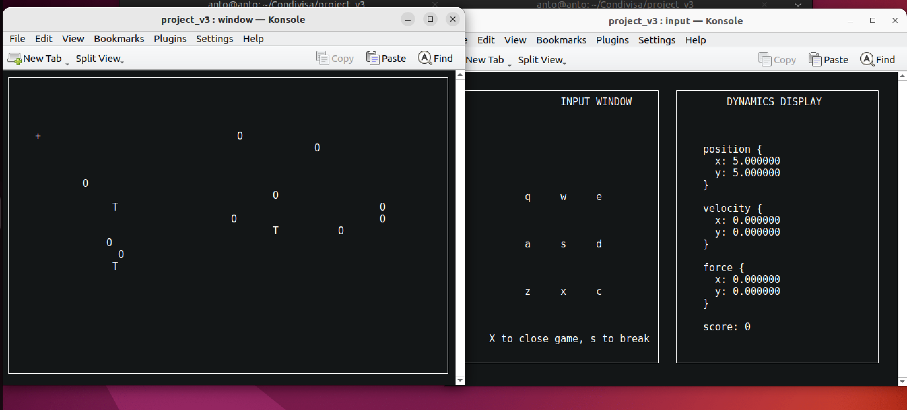

# ARP(Advanced Robotic Programming) Project 

Description
- This repository contains a set of C programs to implement a simple robot 2D game using the library ncurses. 
- Main files: `.c` sources in the root and subfolders, headers in `include/`, configuration in `config/`, logs in `log/`.



Project structure (summary)
- `main.c` — possible entry point (check contents to run the correct binary).
- `input.c` — input handling.
- `server.c` — server-side code.
- `utils.c`, `window.c`, `dynamic.c`, `resize.c`, `obstacles_gen.c`, `target_gen.c`, `tar_gen/`, `obs_gen/` — utilities and generators.
- `include/` — local headers (e.g. `protocol.h`, `utils.h`).
- `config/parameters.txt` — configuration parameters.
- `log/` — logs produced by runs.

Requirements
- `gcc` compiler
- `ncurses` library installed 
- Useful tools: `make`, `bash`.

Build
- Run the following command from the project root to compile all `.c` files. The script.sh file is a simple script file to compile all the programs and link the lib in the `include/` folder. 
```bash
sh script.sh
```

Notes:
- All the executables will be created in the project root folder.

Run
- After building, run the starting `game` executable from the project root folder. 
```bash
./game
```
Notes:
- Make sure to run the exec form the main project folder

Configuration files
- `config/parameters.txt` contains adjustable parameters. Review and edit it before running the program. It is possibile to change some parameters such ad the `ETA` value to compute the repulsion force of the obstacles.

Logs
- Logs are written to the `log/` folder (e.g. `main_log.text`, `input_log.text`, etc.). Each process has its own log file. 


