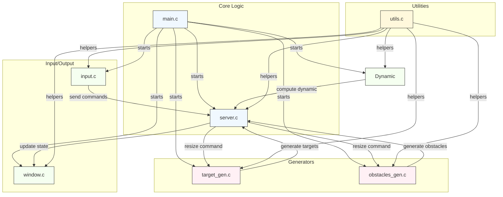

# Project Architecture

This document provides a high-level architecture diagram of the project and a short explanation of components and relationships. The diagram is in Mermaid syntax and can be rendered by editors that support Mermaid (VS Code Mermaid Preview, GitHub, GitLab, etc.).

Structure:
This is a conceptual diagram based on the project repository. It shows the typical roles each entity likely plays:
  - `main.c` is the entry point and likely starts all the processes.
  - `server.c` contains the core logic and coordinates data between target and obstacles generators, input, window and dynamic
  - `input.c` captures user/input events and forwards them to the server logic.
  - `target_gen.c` and `obstacles_gen.c` generate data fed into the server (targets/obstacles).
  - `window.c` handles rendering/displaying state produced by the server using the lib ncurses.
  - `utils.c` provides shared helper functions used across components to load configuration and logging,
  - `config/parameters.txt` provides runtime parameters.
  - `log/` stores runtime logs.

How to render
- Mermaid: view `docs/architecture.md` with a Mermaid-capable viewer.